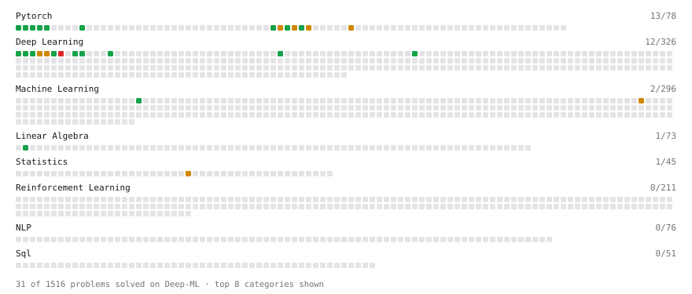

# Deep-ML

My machine learning practice from [Deep-ML](https://www.deep-ml.com). Every solution here was written by hand.

**61** solved · 49 problems · 3 labs · 9 math

[**Browse the interactive portfolio**](https://KashyapPatel2232.github.io/deep-ml/) to replay this filling in over time.

## Problems

| | Difficulty | Solved | |
| --- | --- | --- | --- |
| [Adagrad Optimizer](https://www.deep-ml.com/problems/145) | easy | 2026-10-03 | [solution](problems/0145-adagrad-optimizer) |
| [Add a Bias Vector to a Batch via Broadcasting](https://www.deep-ml.com/problems/882) | easy | 2026-09-29 | [solution](problems/0882-add-a-bias-vector-to-a-batch-via-broadcasting) |
| [Backprop a Linear Layer by Hand](https://www.deep-ml.com/problems/898) | easy | 2026-10-02 | [solution](problems/0898-backprop-a-linear-layer-by-hand) |
| [Batch a TensorDataset with DataLoader](https://www.deep-ml.com/problems/1237) | easy | 2026-10-04 | [solution](problems/1237-batch-a-tensordataset-with-dataloader) |
| [Build a Dataset and Use It with a DataLoader](https://www.deep-ml.com/problems/899) | easy | 2026-10-04 | [solution](problems/0899-build-a-dataset-and-use-it-with-a-dataloader) |
| [Build a Linear Regression Model with nn.Module](https://www.deep-ml.com/problems/885) | easy | 2026-10-04 | [solution](problems/0885-build-a-linear-regression-model-with-nn-module) |
| [Build an MLP with nn.Sequential](https://www.deep-ml.com/problems/887) | easy | 2026-10-04 | [solution](problems/0887-build-an-mlp-with-nn-sequential) |
| [Compute a Gradient with PyTorch Autograd](https://www.deep-ml.com/problems/884) | easy | 2026-09-29 | [solution](problems/0884-compute-a-gradient-with-pytorch-autograd) |
| [Compute Multi-class Cross-Entropy Loss](https://www.deep-ml.com/problems/134) | easy | 2026-09-27 | [solution](problems/0134-compute-multi-class-cross-entropy-loss) |
| [Create a Float Tensor from a Python List](https://www.deep-ml.com/problems/880) | easy | 2026-09-27 | [solution](problems/0880-create-a-float-tensor-from-a-python-list) |
| [Derivatives of Activation Functions](https://www.deep-ml.com/problems/217) | easy | 2026-09-27 | [solution](problems/0217-derivatives-of-activation-functions) |
| [Implement a Linear Layer Forward Pass with Matrix Multiplication](https://www.deep-ml.com/problems/883) | easy | 2026-09-29 | [solution](problems/0883-implement-a-linear-layer-forward-pass-with-matrix-multiplication) |
| [Implement ReLU Activation Function](https://www.deep-ml.com/problems/42) | easy | 2026-09-27 | [solution](problems/0042-implement-relu-activation-function) |
| [Implement ReLU and Leaky ReLU](https://www.deep-ml.com/problems/1226) | easy | 2026-09-29 | [solution](problems/1226-implement-relu-and-leaky-relu) |
| [Implementation of Log Softmax Function](https://www.deep-ml.com/problems/39) | easy | 2026-09-27 | [solution](problems/0039-implementation-of-log-softmax-function) |
| [KL Divergence Between Two Normal Distributions](https://www.deep-ml.com/problems/56) | easy | 2026-09-27 | [solution](problems/0056-kl-divergence-between-two-normal-distributions) |
| [Leaky ReLU Activation Function](https://www.deep-ml.com/problems/44) | easy | 2026-09-27 | [solution](problems/0044-leaky-relu-activation-function) |
| [Linear Kernel Function](https://www.deep-ml.com/problems/45) | easy | 2026-09-27 | [solution](problems/0045-linear-kernel-function) |
| [Mean Squared Error from Scratch](https://www.deep-ml.com/problems/1228) | easy | 2026-09-29 | [solution](problems/1228-mean-squared-error-from-scratch) |
| [Momentum Optimizer](https://www.deep-ml.com/problems/146) | easy | 2026-10-03 | [solution](problems/0146-momentum-optimizer) |
| [Nesterov Accelerated Gradient Optimizer](https://www.deep-ml.com/problems/150) | easy | 2026-10-03 | [solution](problems/0150-nesterov-accelerated-gradient-optimizer) |
| [One SGD Update Step](https://www.deep-ml.com/problems/1234) | easy | 2026-10-04 | [solution](problems/1234-one-sgd-update-step) |
| [Reshape and Transpose a Tensor](https://www.deep-ml.com/problems/881) | easy | 2026-09-29 | [solution](problems/0881-reshape-and-transpose-a-tensor) |
| [Run One Training Step: Forward, Loss, Backward, Optimizer](https://www.deep-ml.com/problems/886) | easy | 2026-10-04 | [solution](problems/0886-run-one-training-step-forward-loss-backward-optimizer) |
| [Save and Load Model Weights with state_dict](https://www.deep-ml.com/problems/888) | easy | 2026-10-04 | [solution](problems/0888-save-and-load-model-weights-with-state-dict) |
| [Sigmoid Activation Function Understanding](https://www.deep-ml.com/problems/22) | easy | 2026-09-27 | [solution](problems/0022-sigmoid-activation-function-understanding) |
| [Single Linear Neuron Forward](https://www.deep-ml.com/problems/1224) | easy | 2026-09-29 | [solution](problems/1224-single-linear-neuron-forward) |
| [Single Neuron](https://www.deep-ml.com/problems/24) | easy | 2026-09-29 | [solution](problems/0024-single-neuron) |
| [Softmax Activation Function Implementation ](https://www.deep-ml.com/problems/23) | easy | 2026-09-27 | [solution](problems/0023-softmax-activation-function-implementation) |
| [Transpose of a Matrix](https://www.deep-ml.com/problems/2) | easy | 2026-09-29 | [solution](problems/0002-transpose-of-a-matrix) |
| [Adam Optimizer](https://www.deep-ml.com/problems/87) | medium | 2026-10-03 | [solution](problems/0087-adam-optimizer) |
| [Analyze Singular Value Spectrum to Determine Intrinsic Rank](https://www.deep-ml.com/problems/876) | medium | 2026-10-03 | [solution](problems/0876-analyze-singular-value-spectrum-to-determine-intrinsic-rank) |
| [Binary Cross-Entropy from Logits](https://www.deep-ml.com/problems/1229) | medium | 2026-09-29 | [solution](problems/1229-binary-cross-entropy-from-logits) |
| [Derivative of Cross-Entropy Loss w.r.t. Logits](https://www.deep-ml.com/problems/220) | medium | 2026-10-02 | [solution](problems/0220-derivative-of-cross-entropy-loss-w-r-t-logits) |
| [Derivative of Softmax](https://www.deep-ml.com/problems/219) | medium | 2026-09-27 | [solution](problems/0219-derivative-of-softmax) |
| [Implement Adam Optimization Algorithm](https://www.deep-ml.com/problems/49) | medium | 2026-10-03 | [solution](problems/0049-implement-adam-optimization-algorithm) |
| [Implement AdamW Optimizer Step](https://www.deep-ml.com/problems/169) | medium | 2026-10-03 | [solution](problems/0169-implement-adamw-optimizer-step) |
| [Implement Gradient Descent Variants with MSE Loss](https://www.deep-ml.com/problems/47) | medium | 2026-10-02 | [solution](problems/0047-implement-gradient-descent-variants-with-mse-loss) |
| [Implement RMSProp Optimizer](https://www.deep-ml.com/problems/200) | medium | 2026-10-03 | [solution](problems/0200-implement-rmsprop-optimizer) |
| [Implementing Basic Autograd Operations](https://www.deep-ml.com/problems/26) | medium | 2026-10-02 | [solution](problems/0026-implementing-basic-autograd-operations) |
| [Numerical Gradient Checking](https://www.deep-ml.com/problems/313) | medium | 2026-10-02 | [solution](problems/0313-numerical-gradient-checking) |
| [Numerically Stable Softmax](https://www.deep-ml.com/problems/1227) | medium | 2026-09-29 | [solution](problems/1227-numerically-stable-softmax) |
| [One Adam Update Step](https://www.deep-ml.com/problems/1236) | medium | 2026-10-03 | [solution](problems/1236-one-adam-update-step) |
| [One Training Step](https://www.deep-ml.com/problems/1219) | medium | 2026-10-04 | [solution](problems/1219-one-training-step) |
| [Poisson Deviance and Overdispersion](https://www.deep-ml.com/problems/1367) | medium | 2026-09-29 | [solution](problems/1367-poisson-deviance-and-overdispersion) |
| [SGD with Momentum Step](https://www.deep-ml.com/problems/1235) | medium | 2026-10-01 | [solution](problems/1235-sgd-with-momentum-step) |
| [Single Neuron with Backpropagation](https://www.deep-ml.com/problems/25) | medium | 2026-09-30 | [solution](problems/0025-single-neuron-with-backpropagation) |
| [Two-Layer MLP Forward Pass](https://www.deep-ml.com/problems/1225) | medium | 2026-09-29 | [solution](problems/1225-two-layer-mlp-forward-pass) |
| [Implementing a Custom Dense Layer in Python](https://www.deep-ml.com/problems/40) | hard | 2026-09-30 | [solution](problems/0040-implementing-a-custom-dense-layer-in-python) |

## Labs

| | Difficulty | Solved | |
| --- | --- | --- | --- |
| [Design Your Own Activation Function](https://www.deep-ml.com/labs/9) | easy | 2026-09-27 | [solution](labs/0009-design-your-own-activation-function) |
| [Design Your Own Optimizer (NumPy)](https://www.deep-ml.com/labs/8) | medium | 2026-10-04 | [solution](labs/0008-design-your-own-optimizer-numpy) |
| [MNIST: Classification Loss (with Gradient)](https://www.deep-ml.com/labs/4) | hard | 2026-10-02 | [solution](labs/0004-mnist-classification-loss-with-gradient) |

## Math

| | Difficulty | Solved | |
| --- | --- | --- | --- |
| [Derivatives and Gradients](https://www.deep-ml.com/math-problems/1) | easy | 2026-09-27 | [solution](math/0001-derivatives-and-gradients) |
| [Gradient Descent Updates](https://www.deep-ml.com/math-problems/5) | easy | 2026-09-27 | [solution](math/0005-gradient-descent-updates) |
| [Vector Operations](https://www.deep-ml.com/math-problems/7) | easy | 2026-10-03 | [solution](math/0007-vector-operations) |
| [Backpropagation and the Chain Rule](https://www.deep-ml.com/math-problems/4) | medium | 2026-09-29 | [solution](math/0004-backpropagation-and-the-chain-rule) |
| [Log-Likelihood Gradients](https://www.deep-ml.com/math-problems/38) | medium | 2026-09-27 | [solution](math/0038-log-likelihood-gradients) |
| [Matrix Calculus Identities](https://www.deep-ml.com/math-problems/35) | medium | 2026-09-29 | [solution](math/0035-matrix-calculus-identities) |
| [Neural Network Derivatives](https://www.deep-ml.com/math-problems/3) | medium | 2026-09-29 | [solution](math/0003-neural-network-derivatives) |
| [Softmax and Cross-Entropy](https://www.deep-ml.com/math-problems/32) | medium | 2026-09-27 | [solution](math/0032-softmax-and-cross-entropy) |
| [Vector Norms and Linear Independence](https://www.deep-ml.com/math-problems/8) | medium | 2026-10-03 | [solution](math/0008-vector-norms-and-linear-independence) |

---

_This file is regenerated by Deep-ML on every push._
